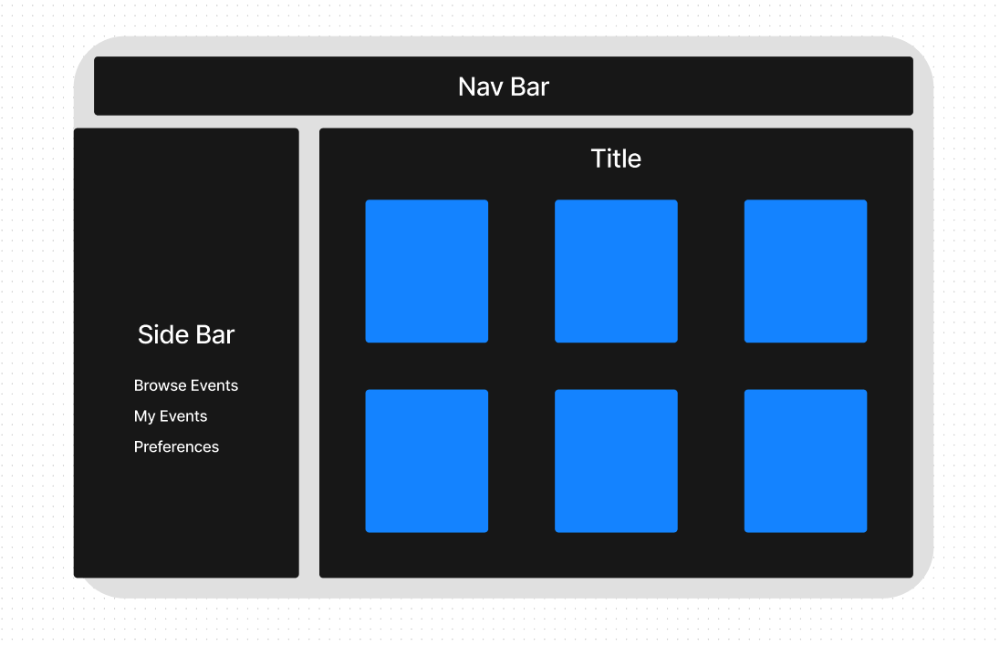

# Wireframes & Software Requirements

## Database Models

[ERD Diagram](assets/spotsModels.png)

### Overview
This documentation presents a detailed explanation of the Entity-Relationship Diagram (ERD) for a web application designed to facilitate event organization, recommendation based on user preferences, real-time chat, and a notification system. The ERD encompasses the models `User`, `Event`, `Preferences`, `Restaurant`, `Chat`, `Message`, and `Notification`, each with specific attributes and interconnected relationships.

### Models and Attributes

#### User
- **userID** (_String_): Unique identifier for each user.
- **username** (_String_): User's chosen username.
- **email** (_String_): User's email address.
- **role** (_Array_): Roles of the user (e.g., attendee, organizer).
- **location** (_String_): Geographical location of the user.

#### Event
- **eventID** (_String_): Unique identifier for each event.
- **name** (_String_): Name of the event.
- **description** (_String_): Detailed description of the event.
- **location** (_String_): Location where the event takes place.
- **startTime** (_Date_): Starting time and date of the event.
- **endTime** (_Date_): Ending time and date of the event.
- **category** (_String_): Category of the event (e.g., music, tech).
- **Organizer** (_String_): Reference to the User who organizes the event.

#### Preferences
- **userID** (_String_): Identifier linking to the User.
- **Interests** (_Array_): User's interests.
- **foodPreferences** (_Array_): User's food preferences.
- **eventPreferences** (_Array_): User's event preferences.

#### Restaurant
- **restaurantID** (_String_): Unique identifier for each restaurant.
- **name** (_String_): Name of the restaurant.
- **location** (_String_): Location of the restaurant.
- **cuisineType** (_String_): Cuisine type offered.
- **rating** (_Integer_): Numerical rating of the restaurant.
- **specialOffers** (_String_): Special offers provided.

#### Chat
- **chatID** (_String_): Identifier for each chat session.
- **participants** (_Array_): UserIDs of chat participants.
- **messages** (_Array_): MessageIDs linking to Message entity.
- **type** (_String_): Type of chat (e.g., private, group).

#### Message
- **senderID** (_String_): Reference to the User sending the message.
- **text** (_String_): Content of the message.
- **timeStamp** (_Date_): Timestamp of message sent.

#### Notification
- **notificationID** (_String_): Identifier for each notification.
- **receiverID** (_String_): Reference to the User receiving the notification.
- **content** (_String_): Content of the notification.
- **timeStamp** (_Date_): Timestamp of notification creation.
- **eventID** (_String_): (Optional) Reference to an Event.
- **restaurantID** (_String_): (Optional) Reference to a Restaurant.

### Relationships

#### User-Preferences
- One-to-one: Each User has one set of Preferences.

#### User-Event (as Organizer)
- One-to-many: A User can organize multiple Events.

#### Preferences-Event
- Many-to-many: Preferences recommend Events to Users.

#### Preferences-Restaurant
- Many-to-many: Preferences recommend Restaurants to Users.

#### User-Chat
- Many-to-many: Users participate in multiple Chats.

#### Chat-Message
- One-to-many: A Chat session contains multiple Messages.

#### User-Message
- One-to-many: Messages are sent by Users.

#### User-Notification
- One-to-many: Notifications are received by Users.

#### Notification-Event/Restaurant
- One-to-one: Notifications linked to specific Events or Restaurants.

### Special Features

#### Real-Time Chat
- Incorporates Socket.io for dynamic chat functionality.

#### Notification System
- Delivers alerts, reminders, and personalized recommendations.

### Conclusion
The comprehensive ERD reflects the intricate structure and functionality of the application, highlighting key entities and their interactions. This design supports effective data management, user engagement, and an enhanced overall user experience.

## User Stories

### Personalized Event Recommendations

**Title**: Personalized Local Event Discovery

**User Story**:
As a travel enthusiast, I want to receive personalized recommendations for local events based on my preferences and current location, so that I can easily discover and experience events that align with my interests.

**Feature Tasks**: 
1. Implement a feature in the backend to access and analyze the user's stored preferences (interests, eventPreferences) and current location.
2. Develop an algorithm to match user preferences and location with available events in the database.
3. Create a system to update the event recommendations in real-time, leveraging Socket.io for instant updates.
4. Implement secure user authentication to protect user data and preferences.
5. Design an API endpoint to serve the personalized event recommendations.

**Acceptance Tests**:
1. Verify that the user receives event recommendations that match their interests and are near their current location via the API.
2. Ensure that the recommendations update in real-time, reflecting any new events or changes in user preferences.
3. Test the security and efficiency of the user authentication process when accessing personalized recommendations.
4. Confirm that the API endpoint correctly delivers the recommended events and handles scenarios where no events match the user's preferences or location.
5. Check the system's performance under various load conditions to ensure scalability and reliability.

### Real-Time Chat Interaction

**Title**: Enhancing User Communication with Real-Time Chat

**User Story**:
As a user of Spots, I want to engage in real-time chat with other users to share experiences and get recommendations, so that I can enhance my travel experience and connect with like-minded individuals.

**Feature Tasks**: 
1. Develop a real-time chat feature using Socket.io that allows users to communicate instantly.
2. Implement chat rooms based on location or interests, facilitating group discussions among users.
3. Ensure that the chat feature includes private messaging capabilities for direct user-to-user communication.
4. Implement robust security measures to protect user privacy and data during chat interactions.
5. Design API endpoints to handle sending and receiving messages, as well as managing chat rooms.

**Acceptance Tests**:
1. Confirm that users can successfully initiate and participate in real-time chat sessions through the backend services.
2. Test the functionality of different chat rooms, ensuring users can join and interact based on their interests or location.
3. Verify that private messaging through the backend is secure, functional, and handles user messages efficiently.
4. Ensure that all chat communications are secure, and user data and privacy are adequately protected.
5. Test the performance and scalability of the chat system under different loads and conditions.

### Efficient Restaurant Discovery

**Title**: Personalized Restaurant Recommendations Based on Preferences

**User Story**:
As a local food enthusiast, I want to discover restaurants based on my cuisine preferences and location, so that I can enjoy dining experiences tailored to my taste.

**Feature Tasks**: 
1. Implement a feature in the backend to access and analyze the user's stored food preferences and current location.
2. Develop an algorithm to match user preferences with restaurants in the database, focusing on cuisine type, location, and ratings.
3. Create a system for providing real-time restaurant recommendations, updated as new data becomes available.
4. Develop API endpoints to serve restaurant recommendations to the frontend.
5. Incorporate user feedback mechanisms in the backend to refine the recommendation algorithm over time.

**Acceptance Tests**:
1. Verify that the backend provides restaurant recommendations that align with the user's cuisine preferences and are nearby their location.
2. Ensure real-time updates of restaurant recommendations in the backend based on the latest data.
3. Test the API endpoints for efficiency and reliability in delivering restaurant recommendations.
4. Check that the backend effectively incorporates user feedback to improve future recommendations.
5. Confirm that the backend recommendation feature works efficiently, even with a large number of users and restaurants in the database.

### Event Organization and Management

**Title**: Simplified Event Creation and Organization

**User Story**:
As an event organizer, I want an intuitive process to create and manage events in the backend, so that I can efficiently organize events and attract the right audience.

**Feature Tasks**: 
1. Implement backend functionalities for event organizers to create new events, including fields for event name, description, location, start and end times, and category.
2. Develop a system in the backend for organizers to update or cancel events and to manage attendee notifications.
3. Create a backend analytics system for organizers to track event interest and attendance.
4. Ensure robust security measures in the backend to protect the integrity and privacy of event-related data.
5. Design API endpoints to facilitate event creation, updates, cancellation, and analytics retrieval.

**Acceptance Tests**:
1. Verify that the backend allows for the easy and intuitive creation of new events.
2. Test the backend functionalities for updating and canceling events, as well as managing attendee notifications.
3. Assess the backend analytics system for its effectiveness in providing meaningful insights to organizers.
4. Ensure that the event data is secure and that the backend handles data with integrity and reliability.
5. Confirm the efficiency and functionality of the API endpoints related to event management.

### User Notification System

**Title**: Customizable and Timely Notifications

**User Story**:
As a user, I want to receive timely notifications about events and restaurant promotions that match my interests, so that I don't miss out on opportunities that are relevant to me.

**Feature Tasks**: 
1. Develop a backend notification system that alerts users about upcoming events and restaurant promotions based on their preferences.
2. Implement customizable notification settings in the backend, allowing users to choose the types and frequency of notifications they receive.
3. Create backend functionality for users to opt-in or opt-out of specific categories of notifications.
4. Ensure that notifications are processed and delivered in a timely manner by the backend system.
5. Integrate the notification system with the backend user profile management to provide personalized alerts.

**Acceptance Tests**:
1. Verify that the backend system sends notifications to users that are relevant to their interests and preferences.
2. Test the effectiveness of the backend's customizable notification settings in providing a tailored user experience.
3. Ensure that the backend's opt-in/opt-out feature for notification categories is functional and meets user needs.
4. Assess the backend system's capability to deliver notifications in a timely and efficient manner.
5. Confirm the integration of the notification system with backend user profiles for accurate personalization.

## Frontend Wireframe Conceptualization

The basic wireframe depicted here lays the foundational design for the application's frontend interface. It is a blueprint that aligns with the application's backend strengths while ensuring a streamlined and user-oriented experience.

### Navigation Bar (Top Bar):
The navigation bar, prominently placed at the top, acts as the cornerstone of navigation throughout the application. It is envisioned to include vital links and facilitate immediate access to user accounts. 

### Sidebar (Toggleable Side Panel):
The design incorporates a retractable sidebar, crafted to enhance the user experience through personalized navigation tailored to individual preferences. This adaptable panel is anticipated to house links for viewing upcoming events, browsing opportunities, event creation, preference modification, and other user-centric functionalities.

### Content Cards:
Central to the interface is the presentation of content within card modules. These cards are envisioned as interactive portals to the application's offerings, such as events and dining options, enabling users to engage with the content actively. Additionally, for administrative users, this area could transform into a dashboard, empowering them to efficiently manage users, events, and app-related operations.

