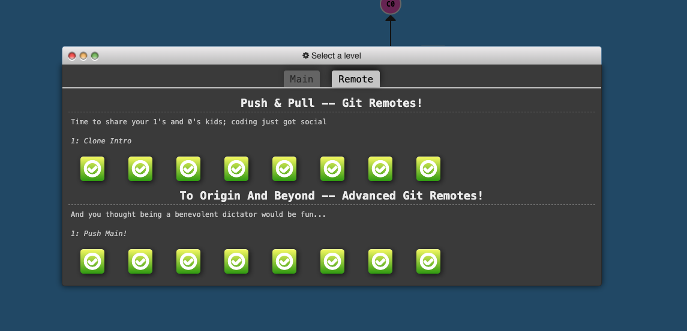

# The Command Line

## Overview

The command line, also known as a terminal, is a text-based interface to the system. Users can enter commands by typing on the keyboard, and the system provides feedback in the form of text. 

## Key Terms

- **Command Line/Terminal**: Text-based interface users enter commands to inteact with the system. 
- **Bash**: A comonly used shell, or part of the operating system that defines how the terminal behaves and runs commands. 
- **Command**: The first thing typed in a terminal. It instructs the system to perform a specific task. 
- **Command Line Arguments**: These follow the command and are separated by spaces. They can modify the behavior of the command. 
- **Option**: A type of command line argument that typically starts with a dash (-). Used to modify the behavior of the command. 
- **Prompt**: Text display in the terminal that indicates readiness to accept commands. 
- **Echo**: A command used to display messages. 

## Syntax

```bash
command -options arguments
```

For example: 

`ls -l /home/ryan`

In this example, `ls` is the command, `-l` is an option, and `/home/ryan/` is an argument. 

## Example

```bash
user@bash: ls -l /home/ryan
total 0
drwxr-xr-x 2 ryan ryan 68 Apr  2 21:01 Desktop
drwxr-xr-x 2 ryan ryan 68 Apr  2 21:01 Documents
user@bash:
```

### Breakdown

1. `user@bash` is the prompt indicating readiness for a command. 
2. `ls -l /home/ryan` is the command, with `-l` as the option and `/home/ryan` as the argument. 
3. Lines 2-4 are the output from running the command, displaying the contents of the `/home/ryan` directory. 
4. The return of `user@bash` signifies the end of the command readiness to accept a new one. 

## Summary

The command line is ap powerful text-based interface for interacting with the system, mainly using the Bash shell. Users enter commands, sometimes accompanied by options and arguments, to instruct the system to perform tasks. Feedback is provided in text form, and various shortcutes are available to make navigation and command entry more efficient. 

# Basic Navigation

- **Print Working Directory (`pwd`)**: Used to know your current location in the system. 
- **Lasting directory contents (`ls`)**: This command llists contents of the directory. It can be used with different options like `-l` for a long listing or a location to list the contents of a specific directory. 
- Two types of paths: 
  - **Absolute** (specified in relation to root directory, begin with `/`).
  - **Relative** (specified in relation to the current location, do not begin with `/`). 
- Shortcuts in paths: 
  - `~` is a shortcut for home directory. 
  - `.` refers to the current directory. 
  - `..` refers to the parent directory. 
- **Change directory (`cd`)**: Used to move around in the system, it requires a location as an argument which can be an absolute or relative path. 
- **Tab Completion**: Helps in auto-completing the paths while typing in the terminal to avoid errors and speed up the process. 

# More About Files

- Everything is a file
  - In Linux, everything, including directories, the kyeboard, and the monitor, is a file. 
- Linus is an Extensionless System
  - Linux doesn't rely on file extensions to identify file types; it checks the file content. 
- Linux is Case Sensitive
  - Linux treats files with the same name but different cases as separate entities. 
- Spaces in Names
  - Spaces are valid in file and directory names but need to be handled carefully
  - Spaces can be handled with quotes or escape characters.
- Hidden Files and Directories
  - Files or directories that begin with a `.` are considered hidden in Linux. 
  - Hidden files are not listen by default with the `ls` command. 
  - `ls -a` Lists the contents of a directory, including hidden files. 

# Manual Pages

**Manual Pages**: A set of pages detailing every command available on your system, including functionality, running specifics, and command-line arguments. 

**Command Structure**: Manual pages typically follow a standard structure-command name, one-line description, synopsis, detailed description, and a list of command-line options. 

**Searching**: Manual pages can be searched with keywords for fidning specific commands or information. It's also possible to search within a particular manual page. 

**Command-Line Options**: Command-line options modify the behavior of commands. They can be invoked in long hand (more human-readable) or shorthand forms. 

**Key Commands**

`man <command>`: Opens the manual page for a specific command. 

`man -k <search term>`: Performs a keyword search acros all manual pages. 

`/<term>`: Searches for a 'term' within a manual page. 

`n`: Selects the next found item after performing a search within a manual page. 

# File Manipulation

## Making a Directory

- `mkdir` is the command to create a new directory. 
  - Syntax: `mkdir [options] <Directory>`
- Directories are created based on the path specified, which can be absolute or relative: 
- Example Commands: 
  - `mkdir /home/ryan/foo`
  - `mkdir ./blah`
  - `mkdir ../dir`
  - `mkdir ~/linuxtutorialwork/dir2`
- Options: 
  - `-p`: Tells `mkdir` to make parent directories as needed. 
  - `-v`: Makes `mkdir` tell us what it is doing. 

## Removing a Directory 

- `rmdir` command removes or deletes a directory.
- Syntax: `rmdir [options] <Directory>`
- Directory must be empty before it may be removed.
- rmdir supports the `-v` and `-p` options similar to mkdir.

## Creating a Blank File

- `touch` command can be used to create blank files.
- Syntax: `touch [options] <filename>`
- The command can also modify the access and modification times on a file.

## Copying a File or Directory 

- `cp` command copies a file or directory. 
- Syntax: `cp [options] <source> <destination>`
- Both the source and destination are paths. 
- `-r` options allows for copying directories recursively. 

## Moving a File or Directory 

- `mv` command copies a file or directory. 
- Syntax: `mv [options] <source> <destination>`
- Both the source and destination are paths.

## Renaing Files and Directories 

- The `mv` command can be creatively used to rename files and directories. 

## Renaing a File (and non empty Directories)

- `rm` command removes or deletes a file. 
- Syntax: `rm [options] <file>`
- `-r` option allows for recursive removal or directories. 
- `-i` option allows for interactive deletion. 

## Summary of Commands

- `mkdir`: Make Directory - Create a directory.
- `rmdir`: Remove Directory - Delete a directory.
- `touch`: Create a blank file.
- `cp`: Copy a file or directory.
- `mv`: Move a file or directory (can also be used to rename).
- `rm`: Remove - Delete a file.

# CheatSheet

## Basic Navigation

- `pwd`: Displays current directory.

- ```
  ls [path]
  ```

  : Lists files in the given path or your current directory.

  - Common options: `-l`, `-h`, `-a`

- `cd [path]`: Changes current directory to the given path or your home directory.

## Understanding Paths

- `Absolute Path`: Starts from the root of the file system (e.g., /etc/sysconfig).
- `Relative Path`: Relative to your current directory (e.g., Documents/music).
- `~ (tilde)`: Represents your home directory in paths (e.g., ~/Documents).
- `. (dot)`: Represents your current directory in paths (e.g., ./bin).
- `.. (dot dot)`: Represents the parent directory of your current directory (e.g., ../bin).
- `TAB completion`: Partially type a command or path and press TAB for auto-completion. Press TAB twice to view alternatives.

## Wildcards

- `*`: Matches zero or more characters (e.g., b*).
- `?`: Matches a single character (e.g., file.???).
- `[ ]`: Matches a range of characters (e.g., b[aio]t).

## Filters

- `head`: Displays the first n lines.
- `tail`: Displays the last n lines.
- `sort`: Sorts lines.
- `wc`: Counts words, characters, and lines.
- `grep`: Searches for a pattern.

## Useful Commands

- `du -sh ./*`: Displays sizes of all directories in your current directory.
- `df -h`: Displays disk space usage.
- `basename -s .jpg -a *.jpg | xargs -n1 -i cp {}.jpg {}_original.jpg`: Copies all jpg files in the current directory and renames them by adding _original.
- `find /home -mtime -1`: Finds all files in /home and subdirectories modified in the last 24 hours.
- `shutdown -h now`: Shuts down the system. Replace `-h` with `-r` for a reboot.

## More About Files

- `file [path]`: Determines a file or directory's type.
- `Spaces in names`: For paths with spaces, either use quotes or a backslash before spaces.
- `Hidden files and directories`: Items starting with a dot are hidden.

## Manual Pages

- `man <command>`: Displays the manual page for a command.
- `man -k <search term>`: Searches for manual pages containing the search term.
- Press `q` to exit man pages.

## File Manipulation

- `mkdir <directory name>`: Creates a directory.

- `rmdir <directory name>`: Removes a directory (only if empty).

- `touch <file name>`: Creates an empty file.

- `cp <source> <destination>`: Copies a file.

- `mv <source> <destination>`: Moves or renames a file.

- ```
  rm <path>
  ```

  : Removes a file or directory.

  - Common options: `-r`, `-f`

## Permissions

- `r (read) w (write) x (execute)`: User permissions for Owner or User, Group, and Others.
- `ls -l [path]`: Views permissions of a file or directory items.
- `chmod <permissions> <path>`: Changes permissions.

## Piping and Redirection

- `>`: Redirects STDOUT to a file.
- `>>`: Appends STDOUT to a file.
- `2>`: Redirects STDERR to a file.
- `<`: Passes a file's content to a program as STDIN.
- `|`: Pipes the STDOUT of the left program as STDIN to the right program.

## Process Management

- `CTRL + C`: Cancels the currently running process.
- `kill <process id>`: Cancels a specific process. Add `-9` option to force kill.
- `ps`: Lists processes and their IDs.
- `CTRL + Z`: Pauses a process and moves it to the background.
- `jobs`: Lists background processes.
- `fg <job number>`: Moves a background process to the foreground.

## Screenshots



