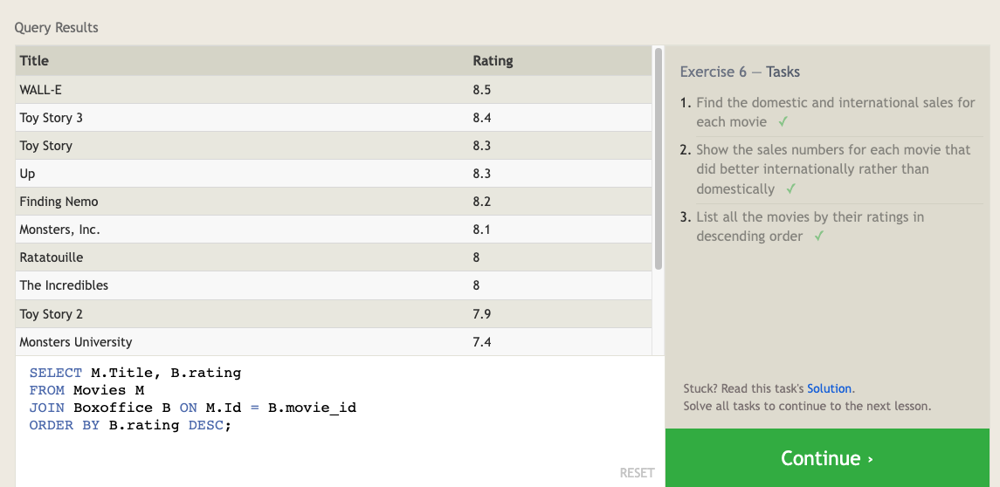

# Intro to SQL

## What is SQL? 

SQL (Structured Query Language), is a language that lets you ask questions, manipulata data, and create changes in a relational database. 

## Key Terms: 

- **SQL**: Structured Query Language designed to allow technical and non-technical users to query, manipulate, and transform data from a relational database. 
- **Relational Databaser**: A collection of related two-dimensional tables with a fixed number of named columns and any number of rows of data. 
- `SELECT`: SQL keyword to specify which columns to retrieve in a query. 
- `FROM`: SQL keyword to specify which table to retrieve data from. 
- `WHERE`: SQL keyword used to filter the results of a query based on conditions that you specify. 
- `DISTINCT`: SQL keyword that allows you to return unique values in the output. It eliminates all the duplicate records and fetches only the unique ones. 
- `ORDER BY`: SQL keyword used to sort the result-set in ascending or descending order.
- `LIMIT` : A clause in SQL. that is used to specify the max number of records to return. 
- `OFFSET`: Allows you to specify the starting point for the rows to return, essentially skipping a certain number of rows from the beginning. 
- `INNER JOIN`: A type of join in SQL that returns only the rows where there is a match in both tables involved in the join. 
- `INSERT`: A statement used in SQL to insert new records into a table. 
- `UPDATE`: A statement used in SQL to modify the existing records in a table. 
- `DELETE`: A statement used in SQL to delete existing records in a table. 
- `CREATE TABLE`: A statement in SQL used to create a new table in the database. 
- `ALTER TABLE`: A statement in SQL used to add, delete/drop, or modify columns in an existing table. 
- `DROP TABLE`: A statement in SQL used to remove an existing table in a database. 

## SELECT

`SELECT` queries in SQL are likea sking questions to a database. They specify what data we are interested in and where to find it in the database. 

### Syntax

```sql
SELECT column_name1, column_name2,...
FROM table_name;
```

- The `SELECT` keyword is followed by the names of the columns to be returned. 
- The `FROM` keyword specifies the table from which to retrieve the data

## WHERE

The `WHERE` clause in SQL is like a filter for your data retrieval. It allows you to specify conditions that the data must meet to be included in your results. 

### Syntax

```sql
SELECT column1, column2
FROM table_name
WHERE condition;
```

### Example

| Id   | Title               | Director       | Year | Length_minutes |
| ---- | ------------------- | -------------- | ---: | :------------: |
| 1    | Toy Story           | John Lasseter  | 1995 |       81       |
| 2    | A Bug's Life        | John Lasseter  | 1998 |       95       |
| 3    | Toy Story 2         | John Lasseter  | 1999 |       93       |
| 4    | Monsters, Inc.      | Pete Docter    | 2001 |       92       |
| 5    | Finding Nemo        | Andrew Stanton | 2003 |      107       |
| 6    | The Incredibles     | Brad Bird      | 2004 |      116       |
| 7    | Cars                | John Lasseter  | 2006 |      117       |
| 8    | Ratatouille         | Brad Bird      | 2007 |      115       |
| 9    | WALL-E              | Andrew Stanton | 2008 |      104       |
| 10   | Up                  | Pete Docter    | 2009 |      101       |
| 11   | Toy Story 3         | Lee Unkrich    | 2010 |      103       |
| 12   | Cars 2              | John Lasseter  | 2011 |      120       |
| 13   | Brave               | Brenda Chapman | 2012 |      102       |
| 14   | Monsters University | Dan Scanlon    | 2013 |      110       |

```sql
SELECT Title, Director, Year
FROM Movies
WHERE Year > 2000;
```

- The `SELECT` keyword is followed by the names of the columns to be returned. 
- The `FROM` keyword specifies the table from which to retrieve the data.
- The `WHERE` clause sets a condition that must be met. 
- The esult will be a set of rows with the specified columns where the movie's release year is greater than 2000. 

### Numerical Operators

| Operator            | Condition                                            | SQL Example                   |
| ------------------- | ---------------------------------------------------- | ----------------------------- |
| =, !=, < <=, >, >=  | Standard numerical operators                         | col_name != 4                 |
| BETWEEN … AND …     | Number is within range of two values (inclusive)     | col_name BETWEEN 1.5 AND 10.5 |
| NOT BETWEEN … AND … | Number is not within range of two values (inclusive) | col_name NOT BETWEEN 1 AND 10 |
| IN (…)              | Number exists in a list                              | col_name IN (2, 4, 6)         |
| NOT IN (…)          | Number does not exist in a list                      | col_name NOT IN (1, 3, 5)     |

### String Operators

| Operator   | Condition                                                    | SQL Example                                                  |
| ---------- | ------------------------------------------------------------ | ------------------------------------------------------------ |
| =          | Case sensitive exact string comparison (notice the single equals) | col_name = "abc"                                             |
| != or <>   | Case sensitive exact string inequality comparison            | col_name != "abcd"                                           |
| LIKE       | Case insensitive exact string comparison                     | col_name LIKE "ABC"                                          |
| NOT LIKE   | Case insensitive exact string inequality comparison          | col_name NOT LIKE "ABCD"                                     |
| %          | Used anywhere in a string to match a sequence of zero or more characters (only with LIKE or NOT LIKE) | col_name LIKE "%AT%" (matches "AT", "ATTIC", "CAT" or even "BATS") |
| _          | Used anywhere in a string to match a single character (only with LIKE or NOT LIKE) | col_name LIKE "AN_" (matches "AND", but not "AN")            |
| IN (…)     | String exists in a list                                      | col_name IN ("A", "B", "C")                                  |
| NOT IN (…) | String does not exist in a list                              | col_name NOT IN ("D", "E", "F")                              |


## DISTINCT

The `DISTINCT` keyword eliminates duplicate records and fetches only the unique ones. 

### Syntax

```sql
SELECT DISTINCT column1, column2
FROM table_name;
```

### Example

| Id   | Title          | Director       | Year | Length_minutes |
| ---- | -------------- | -------------- | ---- | -------------- |
| 1    | Toy Story      | John Lasseter  | 1995 | 81             |
| 2    | A Bug's Life   | John Lasseter  | 1998 | 95             |
| 3    | Toy Story 2    | John Lasseter  | 1999 | 93             |
| 4    | Monsters, Inc. | Pete Docter    | 2001 | 92             |
| 5    | Finding Nemo   | Andrew Stanton | 2003 | 107            |
| ...  | ...            | ...            | ...  | ...            |

To fetch all unique directors from the "Movies" table, we can use `DISTINCT` as follows: 
```sql
SELECT DISTINCT Director
FROM Movies;
```

This will return all unique director names from the Movies table. 

## ORDER BY

The `ORDER BY` keyword is sued to sort the result-set in asc or desc order. 

### Syntax

```sql
SELECT column1, column2, ...
FROM table_name
ORDER BY column1 [ASC|DESC], column2 [ASC|DESC],...;
```

### Example

| Id   | Title          | Director       | Year | Length_minutes |
| ---- | -------------- | -------------- | ---- | -------------- |
| 1    | Toy Story      | John Lasseter  | 1995 | 81             |
| 2    | A Bug's Life   | John Lasseter  | 1998 | 95             |
| 3    | Toy Story 2    | John Lasseter  | 1999 | 93             |
| 4    | Monsters, Inc. | Pete Docter    | 2001 | 92             |
| 5    | Finding Nemo   | Andrew Stanton | 2003 | 107            |
| ...  | ...            | ...            | ...  | ...            |

Fetch all movies and sort them by year in ascending order: 

```sql
SELECT Title, Year
FROM Movies
ORDER BY Year DESC;
```

This will return the movie titles and years, sorted by year in descending order. 

## LIMIT && OFFSET

`LIMIT` is often used with `SELECT` to restrict the amount of data that the statement returns. `OFFSET` can be used with `LIMIT` to specify the number of records to skip before starting to return the records. 

### Syntax

```sql
SELECT column1, columm2, ...
FROM table_name
LIMIT number [OFFSET number];
```

### Example

| Id   | Title          | Director       | Year | Length_minutes |
| ---- | -------------- | -------------- | ---- | -------------- |
| 1    | Toy Story      | John Lasseter  | 1995 | 81             |
| 2    | A Bug's Life   | John Lasseter  | 1998 | 95             |
| 3    | Toy Story 2    | John Lasseter  | 1999 | 93             |
| 4    | Monsters, Inc. | Pete Docter    | 2001 | 92             |
| 5    | Finding Nemo   | Andrew Stanton | 2003 | 107            |
| ...  | ...            | ...            | ...  | ...            |

Fetch the top 3 movies based on the year, and skip the first movie from the result: 

```sql
SELECT Title, Year
FROM Movies
ORDER BY Year DESC
LIMIT 3 OFFSET 1;
```

This will return the titles and years of the 2nd, 3rd, and 4th most recent movies. 

## INNER JOIN

`INNER JOIN` returns only the rows where there is a match in both tables involved in the join. 

### Syntax

```sql
SELECT column_names(s)
FROM table_1
INNER JOIN table_2
ON table1.column_name = table2.column_name;
```

### Example

Table: Movies

| Id   | Title          | Director       | Year | Length_minutes |
| ---- | -------------- | -------------- | ---- | -------------- |
| 1    | Toy Story      | John Lasseter  | 1995 | 81             |
| 2    | A Bug's Life   | John Lasseter  | 1998 | 95             |
| 3    | Toy Story 2    | John Lasseter  | 1999 | 93             |
| 4    | Monsters, Inc. | Pete Docter    | 2001 | 92             |
| 5    | Finding Nemo   | Andrew Stanton | 2003 | 107            |
| ...  | ...            | ...            | ...  | ...            |

Table: Boxoffice

| Movie_id | Rating | Domestic_sales | International_sales |
| -------- | ------ | -------------- | ------------------- |
| 5        | 8.2    | 380843261      | 555900000           |
| 14       | 7.4    | 268492764      | 475066843           |
| 8        | 8      | 206445654      | 417277164           |
| ...      | ...    | ...            | ...                 |

Fetch the titles of the movies, their ratings, and sales: 

```sql
SELECT Movies.Title, Boxoffice.Rating, Boxoffice.Domestic_sales, Boxoffice.International_sales
FROM Movies
INNER JOIN Boxoffice
ON Movies.Id = Boxoffice.Movie_id;
```

This will return the titles of the movies, their ratings, domestic and interational sales where the movie's id matches in both tables


## INSERT INTO

The `INSERT INTO` statement is used to insert new records into a table. There are two ways this statement can be used: 

1. Specifying both column names and the values to be inserted. 
2. Specifying only the values, assuming they are given in the same order as the columns of the table. 

### Syntax

```sql
INSERT INTO table_name (column1, column2, column3, ...)
VALUES (value1, value2, value3, ...);
```

OR

```sql
INSERT INTO table_name
VALUES (value1, value2, value3, ...);
```

### Example

Table: Movies

| Id   | Title          | Director       | Year | Length_minutes |
| ---- | -------------- | -------------- | ---- | -------------- |
| 1    | Toy Story      | John Lasseter  | 1995 | 81             |
| 2    | A Bug's Life   | John Lasseter  | 1998 | 95             |
| 3    | Toy Story 2    | John Lasseter  | 1999 | 93             |
| 4    | Monsters, Inc. | Pete Docter    | 2001 | 92             |
| 5    | Finding Nemo   | Andrew Stanton | 2003 | 107            |
| ...  | ...            | ...            | ...  | ...            |

Add a new movie, "Toy Story 4", into the "Movies" table: 

```sql 
INSERT INTO Movies (Id, Title, Director, Year, Length_minutes)
VALUES (15, 'Toy Story 4', 'Josh Cooley', 2019, 100);
```

Now the 'Movies' table will have a new row with "Toy Story 4" and its associated information. 

### Example 2

Table: Boxoffice

| Movie_id | Rating | Domestic_sales | International_sales |
| -------- | ------ | -------------- | ------------------- |
| 5        | 8.2    | 380843261      | 555900000           |
| 14       | 7.4    | 268492764      | 475066843           |
| 8        | 8      | 206445654      | 417277164           |
| 12       | 6.4    | 191452396      | 368400000           |
| 3        | 7.9    | 245852179      | 239163000           |
| ...      | ...    | ...            | ...                 |

After the release of 'Toy Story 4', we want to add its Box office info into the 'Boxoffice' table. We know that "Toy Story 4" is movie `Id 15` from our `Movies` table. Given that "Toy Story 4" had a rating of 8.7, made 340 million domestically and 270 million internationally, we can use the `INSERT INTO` statement as follows:

```sql
INSERT INTO Boxoffice (Movie_id, Rating, Domestic_sales, International_sales)
VALUES (15, 8.7, 340000000, 270000000);
```

## UPDATE

The `UDPATE` statement is used to modify the existing records in a table. 

### Syntax

```sql
UPDATE table_name
SET column1 = value1, column2 = value2, ...
WHERE condition;
```

- `table_name`: Specifies the table you want to update. 
- `SET`: This clause indicates the column names and new values you want to update. You can list multiple column-value pairs separated by commas. 
- `WHERE`: This clause specifies which record(s) should be updated. If you omit the `WHERE` clause, all records in the table will be updated. 

### Example

Table: Movies

| Id   | Title        | Director       | Year | Length_minutes |
| ---- | ------------ | -------------- | ---- | -------------- |
| 1    | Toy Story    | John Lasseter  | 1995 | 81             |
| 2    | A Bug's Life | Andrew Stanton | 1998 | 95             |
| 3    | Toy Story 2  | John Lasseter  | 1999 | 93             |
| ...  | ...          | ...            | ...  | ...            |

We realize that the director for "A Bug's Life" is incorrect. It was actually directed by John Lasseter. To correct this, we can use the `UPDATE` statement as follows:

```sql
UPDATE Movies
SET Director = 'John Lasseter'
WHERE Title = "A Bug's Life";
```

Now, the `Movies` table will show the correct director for "A Bug's Life".

### Example 2

The year that Toy Story 2 was released is incorrect, it was actually released in **1999**. 

```sql
UPDATE Movies
SET Year = 1999
WHERE Title = "Toy Story 2";
```

### Example 3

Both the title and director for Toy Story 8 is incorrect! The title should be "Toy Story 3" and it was directed by **Lee Unkrich**

```sql
UPDATE Movies
set TITLE = 'Toy Story 3', Director = 'Lee Unkrich'
WHERE Title = 'Toy Story 8';
```

## DELETE

The `DELETE` statement is used to delete existing records in a table. It is a powerful command and should be used carefully as once the data is deleted, it can't be recovered. 

### Syntax

```sql
DELETE FROM table_name
WHERE condition;
```

### Example

Consider the `Movies` table. If the database is getting too large, and you wish to delete all movies that were released before 2005, you would use the `DELETE` statement as follows:

```sql
DELETE FROM Movies
WHERE Year < 2005;
```

This command will delete all records from the Movies table where the 'Year' is less than 2005. As always, be careful when using the `DELETE` command, especially without a `WHERE` clause, as it will remove all data from the specified table. 

**Note:** It is a good practice to first run a `SELECT` statement to verify the records that will be deleted before running the `DELETE` statement.

### Example 2

If you need to remove all movies directed by a specific director, such as Andrew Stanton, you would use the `DELETE` statement with a condition on the `Director` field. Here is how you can do it:

```sql
DELETE FROM Movies
WHERE Director = 'Andrew Stanton';
```

This command will delete all records from the `Movies` table where the `Director` is 'Andrew Stanton'. As with any `DELETE` statement, you should be careful when executing it to ensure you don't unintentionally delete records you want to keep.

**Note:** Always make sure to double-check the condition in your `DELETE` statement by running a `SELECT` query with the same condition before executing the `DELETE`.

## CREATE TABLE

The `CREATE TABLE` statement is used to create a new table in the database. The command requires the table name and the column definitions including the data type and any constraints. 

### Syntax

```sql
CREATE TABLE table_name (
    column1 datatype constraint,
    column2 datatype constraint,
    column3 datatype constraint,
    ....
);
```


### Data Types

| Data type                                      | Description                                                  |
| ---------------------------------------------- | ------------------------------------------------------------ |
| INTEGER, BOOLEAN                               | Store whole integer values like a count of a number or an age. Boolean is often represented as an integer of 0 or 1. |
| FLOAT, DOUBLE, REAL                            | Store more precise numerical data like measurements or fractional values. Different types can be used depending on the required precision. |
| CHARACTER(num_chars), VARCHAR(num_chars), TEXT | Store strings and text in various locales. CHARACTER and VARCHAR are specified with the max number of characters that they can store (longer values may be truncated). |
| DATE, DATETIME                                 | Store date and time stamps to keep track of time series and event data. Can be tricky when manipulating data across timezones. |
| BLOB                                           | Store binary data in blobs right in the database. Usually stored with the right metadata to requery them. |

### Table Constraints

| Constraint         | Description                                                  |
| ------------------ | ------------------------------------------------------------ |
| PRIMARY KEY        | Values in this column are unique, each value can identify a single row in this table. |
| AUTOINCREMENT      | For integer values, value is automatically filled in and incremented with each row insertion. Not supported in all databases. |
| UNIQUE             | Values in this column have to be unique, can't insert another row with the same value in this column as another row in the table. |
| NOT NULL           | The inserted value can not be `NULL`.                        |
| CHECK (expression) | Allows you to run a more complex expression to test whether the inserted values are valid. |
| FOREIGN KEY        | A consistency check which ensures that each value in this column corresponds to another value in a column in another table. |

### Example

Create a new table called "Database" with three columns: Name (text), Version (floating point number), and Download_count (integer). 

```sql
CREATE TABLE Database (
    Name TEXT,
    Version REAL,
    Download_count INTEGER
);
```

### REAL VS FLOAT

Both `REAL` and `FLOAT` are used to represent floating-point numbers in SQL, but the actual precision can depend on the specific database system you are using. In many SQL databases, `REAL` is used as a synonym for `FLOAT`.

So, in some contexts, `REAL` and `FLOAT` can be used interchangeably, but in some databases, they might have slightly different storage or precision characteristics.

Here's a brief explanation of the difference:

- `FLOAT` is a floating-point number of variable precision. The precision and the scale of a `FLOAT` can vary depending on what you need. It can store much larger or much smaller numbers, which makes it quite flexible.
- `REAL` is a floating-point number that has 4 bytes of storage. It's also known as single precision. `REAL` is used when you need to store floating-point numbers, but you don’t need the precision of `FLOAT`.

So in this context, `REAL` is also a floating point number, but if you're working with a database that distinguishes between `FLOAT` and `REAL`, and you want more precision, you should use `FLOAT`. If the distinction is not important for your use case, you can use `REAL` and `FLOAT` interchangeably.

## ALTER TABLE

The `ALTER TABLE` statement in SQL is used to add, delete/drop, or modify columns in an existing table. It' also used to add and drop various constraints on an existing table. 

### Syntax for adding a column: 

```sql
ALTER TABLE table_name
ADD column_name datatype;
```

### Syntax for dropping a column: 

```sql
ALTER TABLE table_name
DROP COLUMN column_name;
```

### Syntax for renaming a table: 

```sql
ALTER TABLE old_table_name
RENAME TO new_table_name;
```

### Example

Let's add a column named "Aspect_ratio" with FLOAT data type to the Movies table: 

```sql
ALTER TABLE Movies
ADD Aspect_ratio FLOAT;
```

This command will alter the "Movies" table and add a new column named "Aspect_ratio" that can store floating-point numbers. This new column can be used to store the aspect ratio each movie was released in.

Keep in mind that once you've added this column, it will be empty (NULL) for all existing rows. You would likely want to use an `UPDATE` statement afterwards to fill in these values if you have the necessary data.

Remember that different databases might have different syntax for `ALTER TABLE` statements. The above examples work for many SQL databases such as SQLite, MySQL, and PostgreSQL, but you should check the documentation for your specific database to ensure the syntax is correct.

### Example 2

Add a column named "Language" with TEXT data type with a default value of "English" to the "Movies" table.

```sql
ALTER TABLE Movies
ADD Language TEXT DEFAULT 'English';
```

This command will alter the "Movies" table and add a new column named "Language" that can store text. This new column will be used to store the language in which each movie was released. If no language is specified while inserting new records, "English" will be used as a default language.

As always, remember to consult the specific syntax and capabilities of your SQL database as not all databases support adding columns with default values directly via the `ALTER TABLE` statement. In some databases, you might have to add the column and then use an `UPDATE` statement to fill in the default values.

## DROP TABLE

The `DROP TABLE` statement is used to remove an existing table in a database. The operation removes the table structure and all the data, indexes, triggers, constraints, and permission specifications for that table. Please note that once the table is deleted, all the information in the table is lost and cannot be recovered.

### Syntax

```sql
DROP TABLE IF EXISTS table_name;
```

### Example

Remove the Movies table: 
```sql
DROP TABLE IF EXISTS Movies;
```


## Exercise 1-6, and 13-18 Screenshots: 





